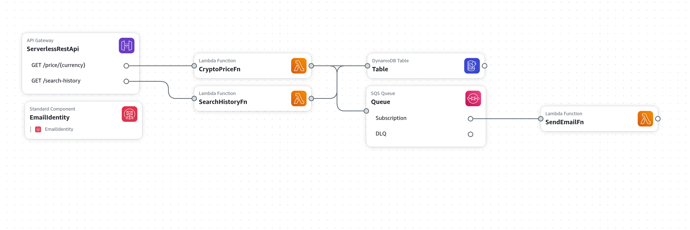

# About
## Infrastructure visualization

1. ServerlessRestApi
    * public interface of project
2. CryptoPriceFn
    * lambda
2. SearchHistoryFn
    * lambda
4. Table
    * database
5. Queue
    * job delivery
6. SendEmailFn
    * lambda (internal only, subscribed to queue, used for email sending)